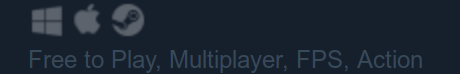
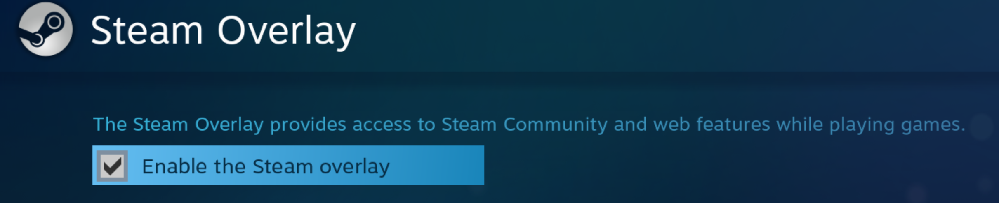
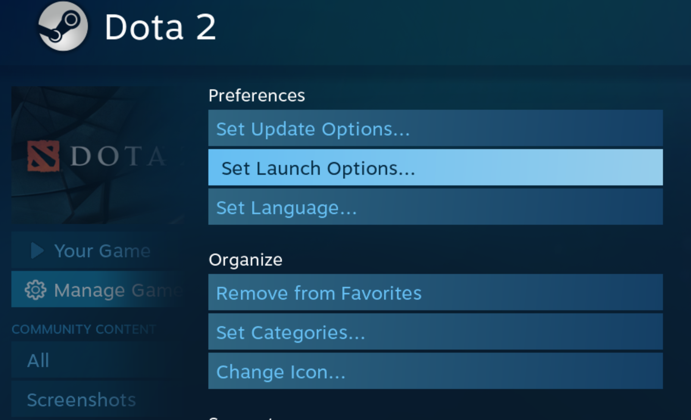

# Steam OverLay

Steam is big and cool game market in the world that is under Valve Organization and has itself some games and items.

At first it was just on the windows OS and not support Linux and macOS operating systems but now these days you will see steam on every platform that exist because is porting to Linux and support macOS.

Steam has itself a Linux operating system named **SteamOS** but a few poeple know this and it's not popular yet.

When you install every Linux OS, you can install Steam on it and play games that support **SteamOS + Linux** and show icon steam near macOS and Windows that marked.




## Whats this article about ?

So this article is about, How to fix SteamOverLay in games.


## What is SteamOverLay ?

By the way this option is to easy communicate steam app itself with your games when you are in games.

So you should go out of games and return for some doing games like check score, buy items in market, Add friends, chat with your friends in PV and so on.

So steam create an option with **Shift+Tab** and when you click it in game you can access these features and no need to quit and enter game again.





## Error

So yes, there is some error for it specially in LinuxOS and macOS.


#### Whats that ?

When you clikc shift+Tab there is nothing happened and you can't enable it or open it.

There is fixes e.g :

1. In windows - Open Steam as **Run as Admin**
2. Open setting and change the keyword
3. Restart your steam
4. And so on simple fixes

But maybe none of these fix your error and issue and bug.


## Let's start

So my OS is Arch Linux, As always.

Then, I set some Lunch option for runnig Dota2 smoothly and fewer lag with optimus laptop in **steam > properties > Set Lunch Options** 





and that is :

```sh
LD_PRELOAD="libpthread.so.0 libGL.so.1" __GL_THREADED_OPTIMIZATIONS=1 optirun %command% -console
```


But when you run steam in terminal it saying that this part is not loaded and failed to turn on the steamOverLay so this option is not render and it is turn off.

So you must delete those commands in lunch option and copy hte new one with no lag and same performance as above command.


```sh
optirun %command% -console
```


just save it - restart OS - restart Steam - Run steam - Run game - and click **Shift+Tab** again.

You will see and be happy with that.

**Note** You can use this command as well with no error and failed to render steam objects :


```sh
__GL_THREADED_OPTIMIZATIONS=1 optirun %command% -console
```


## Author

Jarvis Mercer

**SteamID** : `jarvisnt`


## License

All of content in this repo is under CC-4 Creative Common 4 License

Thanks