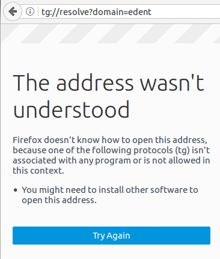

# Fix Telegram tg Protocol

As you know Telegram is a communication application for various platform like **Windows** **macOS** and lovely **Linux** that focus on Easy, Secure and Super Fast communication app system in open source world.

Written by Russians and use super secure **encryption** **AES-256** for private chat. Cool :)

This app has got a **handler scheme** in browser named **``tg``** handler that when you visit a site like **www.telegram.me/exampleID** this handler must turn on and ask you want to open telegram app and goto in **``exampleID``**.

So mostly Firefox has got problem because of its technology using, Firefox use boolean ``auto:config`` but Google Chrome or Chromium use ``xdg-open`` or ``xdg-scheme``.

For Firefox we must set manually ``xdg-scheme`` in our OS, mine is **Arch Linux** my second love in the world, and mostly this problem appear in Linux systems not Windows or macOS.

## What is the problem ?

The problem is simple, When you open that kind of refers site to resolve ``exampleID`` and open telegram, then **``tg``** handler doesn't work and nothing appear or asking you for opening Telegram but some thing like this appear :

  

This picture saying that browser can not resolve the domain and protocol, so what should we do then ??

## Getting Start

Before you start for fixing this problem, check the requirements first :

#### Requirements

1. Official Telegram APP from Telegram site or **AUR** (Arch Users Repository) package official compiled for Arch Linux users.
2. Set your terminal in **non Root** user for avoid dangerous things :)
3. Check your OS specially Linux users has **xdg** packages or **mime type** or both.
4. Check you have these files and path :
   1. **mimeapps.list**
   2. **telegram.desktop**
   3. location | ==> **~/.local/share/mime**
   4. location | ==> **~/.config/mimeapps.list**

 update-mime-database ~/.local/share/mime

$ >  .config  nano mimeapps.list

x-scheme-handler/tg=firefox.desktop;
