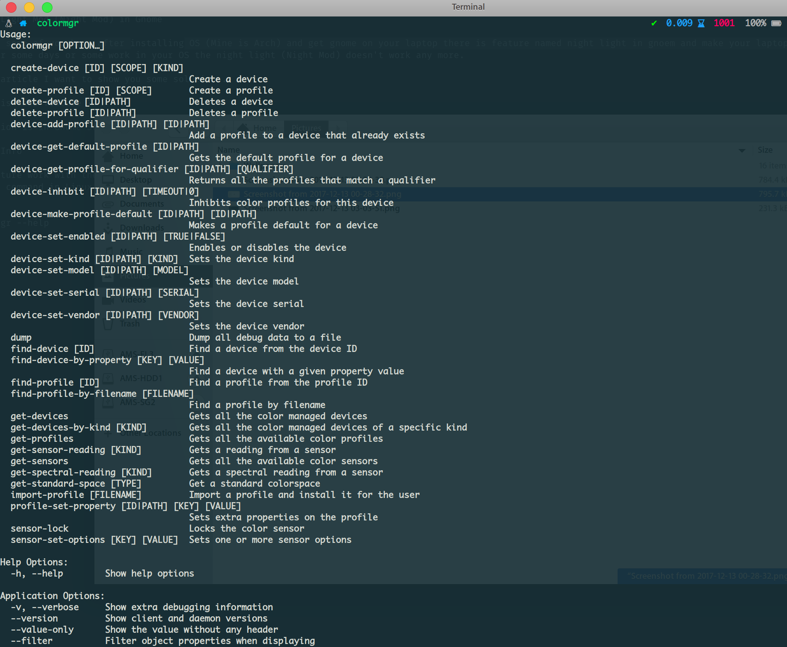
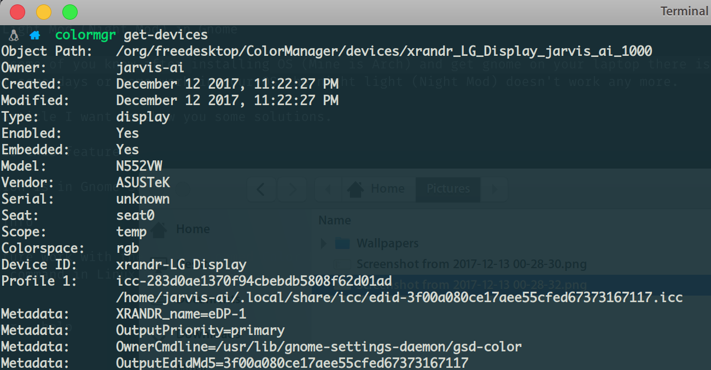

# Night Light Mod (Night Mod) in Gnome

As maybe some of you know after installing OS (Mine is Arch) and get gnome on your laptop there is feature named night light in gnoem and make your laptop screen warmer to help your eyes.
But after some days or some work in your OS the night light (Night Mod) doesn't work any more.

In this article I want to show you some solutions.

## What is this feature ?

This option is in Gnome Settings -> Devices -> Display -> Night Light

## Some Info

This feature work with the package named Color Management. This mechanism identified your screen and do night mod - cold color - warm color - white color - negative - and so on.
There is command in Linux OS :

```sh
$ colormgr --help
```

<div style="align:center;">
  
</div>

So when your night light working means your colormgr found your screen monitor and manage colors.

This is the commnad when your device working good.

```sh
$ colormgr get-device
```

<div style="align:center;">
  
</div>

As you see the colormgr connect with `xrandr` the **xorg** tools that working on monitor and manage the color of LCD.

But when your deivece stoped night light , that command shows nothing after enter.

## Get start

We have some solutions for this problem :

1. Reinstall colormgr + reboot(log out)
2. Reinstall colord + reboot(log out)
3. Reinstall gnome-color-manager + reboot(log out)
4. My solution

So in 1 to 3 is clearly light that you must install again these packages and see if night light going to work again.

If none of thoese work you can try this.

At first check that 2 commands if not work `colormgr` then open a terminal and commnad this :

```sh
$ ls  /usr/share/polkit-1/actions
```
These is alot of files in there, We need the file named **`org.freedesktop.color-manager.create-device.policy`** and with this command move the file.

```sh
$ sudo mv /usr/share/polkit-1/actions/org.freedesktop.color-manager.create-device.policy ~/Desktop
```

So after this you should log out and log in or reboot , Tada your night light work again.

If you have any question you can contact me.

## Thanks

Thank you again for follow one of our other solving tut.
If our solving is useful for you come and give me a star, its like a cup of coffee. :)
Thanks.
